# A simple 3D renderer from scratch

A minimalist 3D renderer implemented in C++ with **~~almost~~ zero external dependencies**, running entirely on CPU. 
It implements its own rasterization, matrix transformations in 3D and shading techniques.

## 🚀 Quick Start with CMake

**Requirements**: CMake v3.16+, C++ v17+

```
git clone https://github.com/M1v1savva/mini-renderer.git
cd mini-renderer
mkdir build && cd build
cmake ..
make
cd ../output/
./mini-renderer --mode texp --path out.tga --config ../config.json
```
**See out.tga**

---

### Results 

Given two files:  
- `*.obj` (polygonal mesh)  
- `*.tga` (texture)  

The renderer is producing images like this:

<table>
<tr>
  <td style="text-align: center;">
    <br>
    Gouraud shading (no texture)
  </td>
  <td style="text-align: center;">
    <br>
    Phong shading (with texture)
  </td>
</tr>
</table>

---

### Features

- **Z-buffering**: depth handling for correct rendering order  
- **Transformations**: camera view, projection, viewport; applied to lights too  
- **Rasterization**: texture mapping, Gouraud and Phong shading
- **Modularity**: camera view configured in `config.json`, loaders, mini geometry library, rasterizer factory

---

### Reference

This project is my hands-on take on [ssloy's Tinyrenderer](https://github.com/ssloy/tinyrenderer/wiki). The model used to generate examples with the renderer is the model used in the blog with the permission from creator.  

While TinyRenderer prioritizes minimal code, **mini-renderer** uses a more object-oriented design, making it easier to embed in a GUI or extend for other uses. 

---

### Examples

<table>
<tr>
  <td style="text-align: center;">
    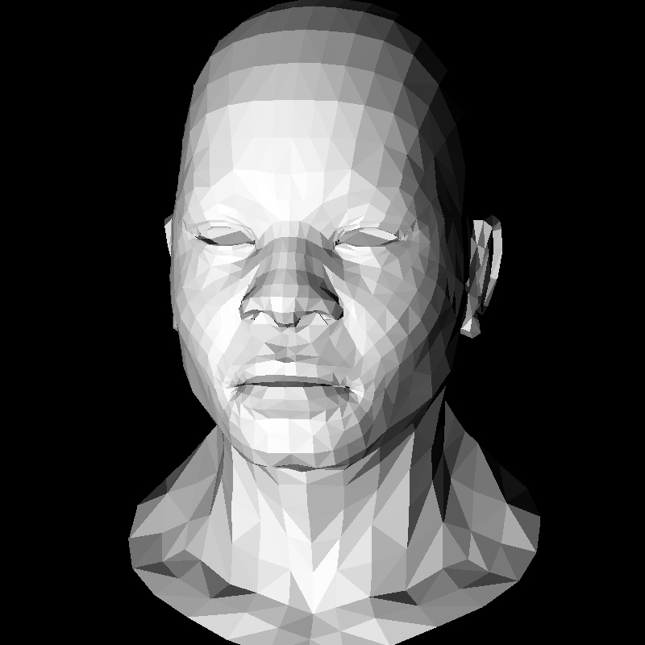<br>
  </td>
  <td style="text-align: center;">
    <br>
  </td>
  <td style="text-align: center;">
    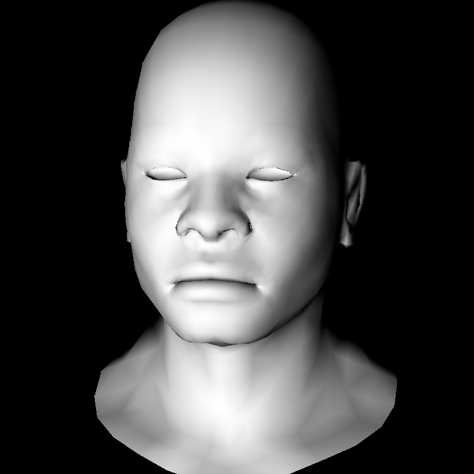<br>
  </td>
  <td style="text-align: center;">
    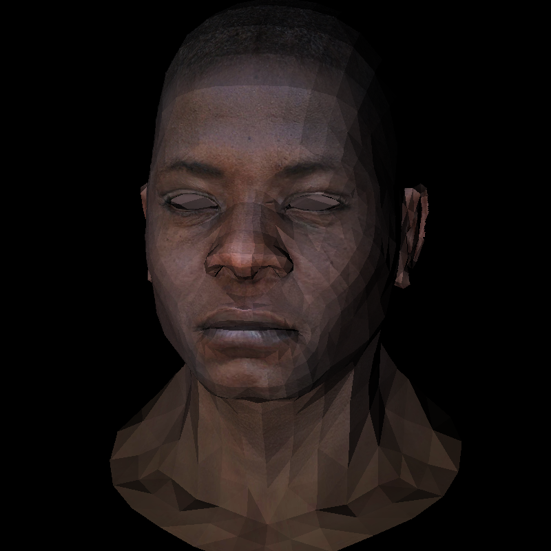<br>
  </td>
  <td style="text-align: center;">
    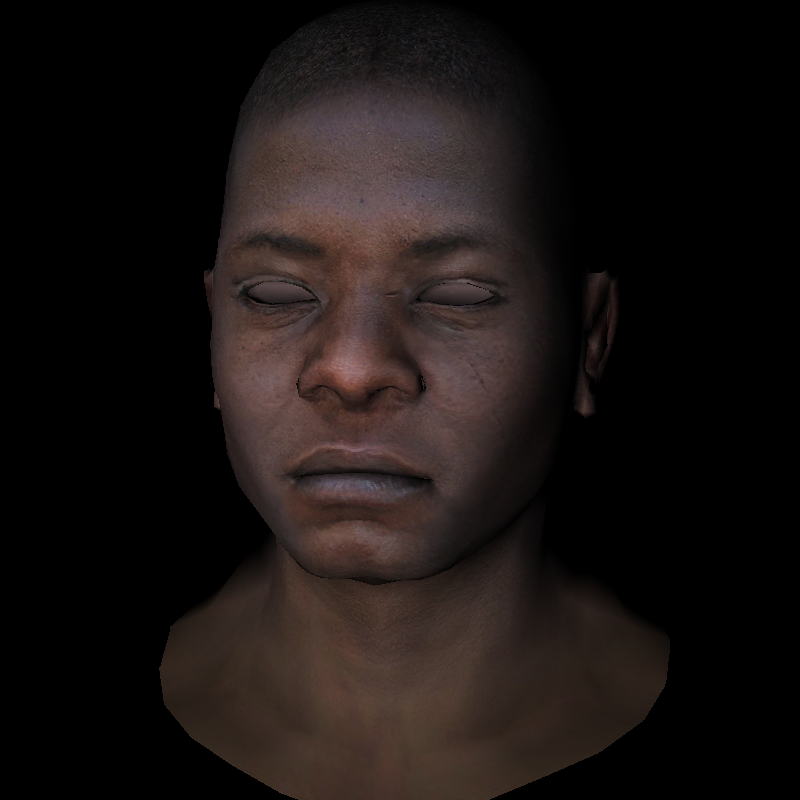<br>
  </td>
  <td style="text-align: center;">
    <br>
  </td>
</tr>
<tr>
  <td style="text-align: center;">
    <br>
  </td>
  <td style="text-align: center;">
    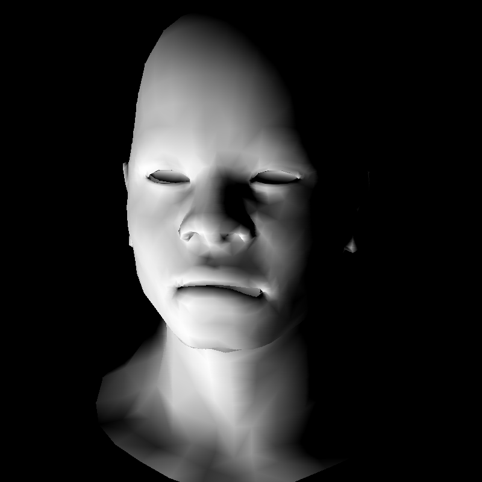<br>
  </td>
  <td style="text-align: center;">
    <br>
  </td>
  <td style="text-align: center;">
    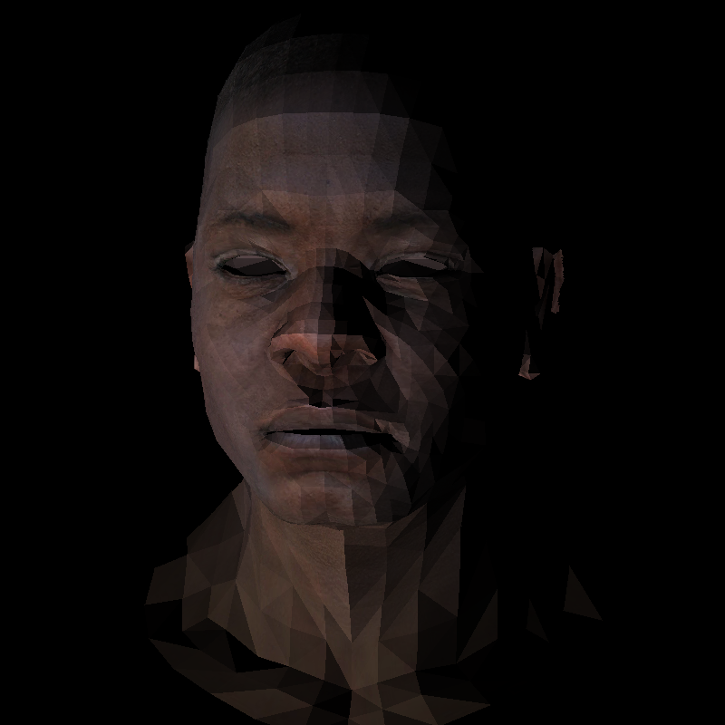<br>
  </td>
  <td style="text-align: center;">
    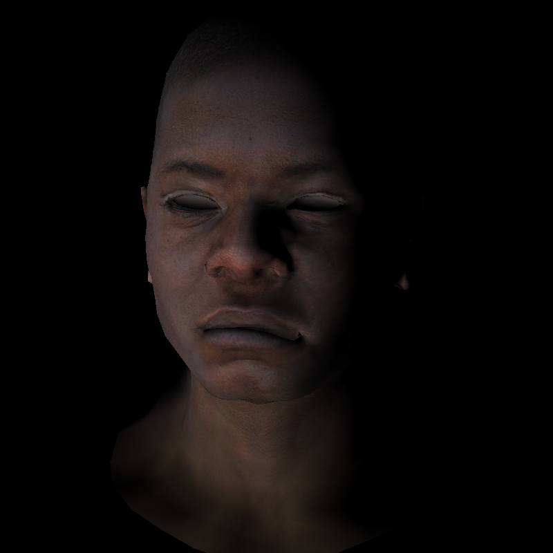<br>
  </td>
  <td style="text-align: center;">
    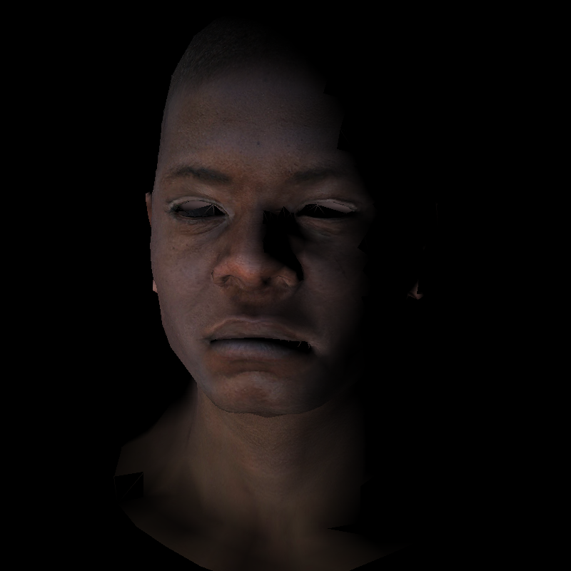<br>
  </td>
</tr>
<tr>
  <td style="text-align: center;">
    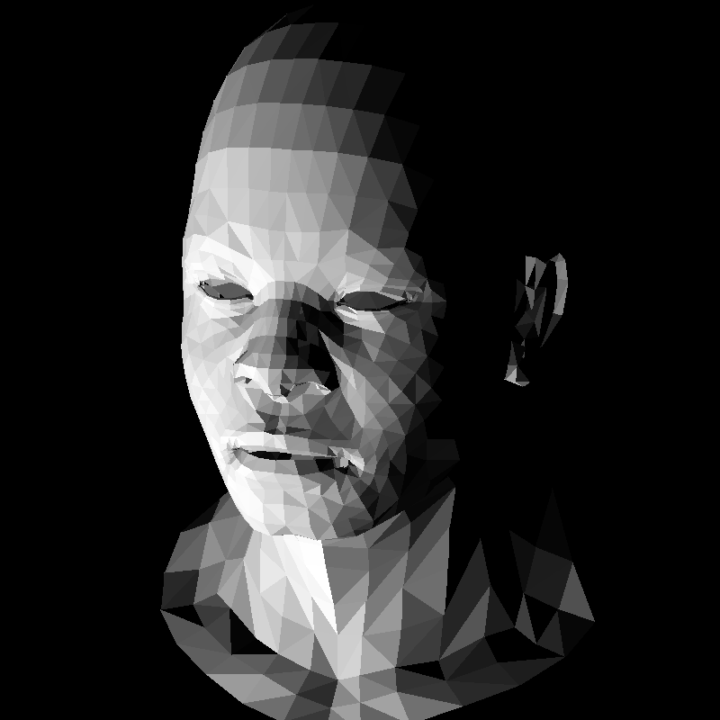<br>
  </td>
  <td style="text-align: center;">
    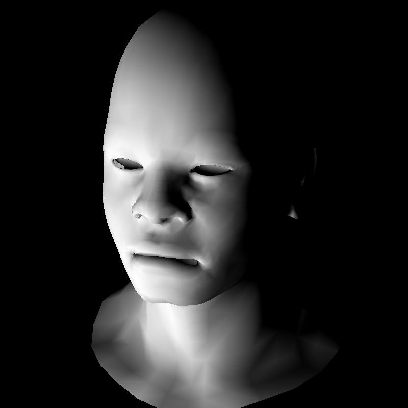<br>
  </td>
  <td style="text-align: center;">
    <br>
  </td>
  <td style="text-align: center;">
    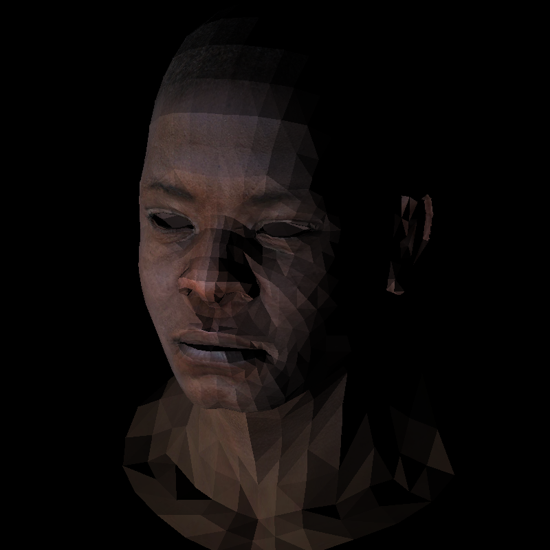<br>
  </td>
  <td style="text-align: center;">
    <br>
  </td>
  <td style="text-align: center;">
    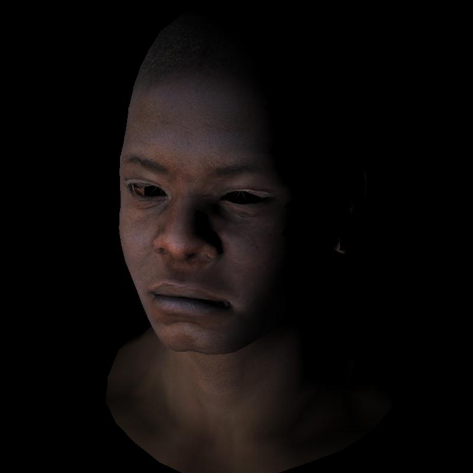<br>
  </td>
</tr>
</table>

---

### ▶️ Run

Run `./mini-renderer` to see help.

#### Flags
Required:<br/>
- `--mode`   : RASTERIZER_MODE  
- `--path`   : path to the output bmp    
Optional:<br/>
- `--config` : path to the config json 

**RASTERIZER_MODE options:**

- `bin`   - black & white with basic lighting  
- `bing`  - black & white with Gouraud shading  
- `binp`  - black & white with Phong shading  
- `tex`   - color with basic lighting  
- `texg`  - color with Gouraud shading 

#### Example
```
./mini-renderer --mode bing --path out.tga --config ../config.json
```

---

You can adjust the scene in `config.json` by tweaking `eye` and `light` vectors. Other fields are left in for debugging.

```
{
  "model_path":   "../obj/african_head.obj",
  "texture_path": "../obj/african_head_diffuse.tga",
  "output_width":  800,
  "output_height": 800,
  "output_depth":  255,
  "eye":      [3.0, -3.0, 6.0],
  "center":   [0.0, 0.0,  0.0],
  "vertical": [0.0, 1.0,  0.0],
  "light":    [0.0, 0.0, -1.0]
}
```

---

### ✅ Running Tests

Run `ctest` from `build/` folder to run all tests.

After the build, test binaries will be in the `output/` folder:

```
./test_vec
./test_matrix
./test_model
./test_graphics
```
---

### 📝 License

This project is licensed under the BY-NC-SA 4.0 License.
